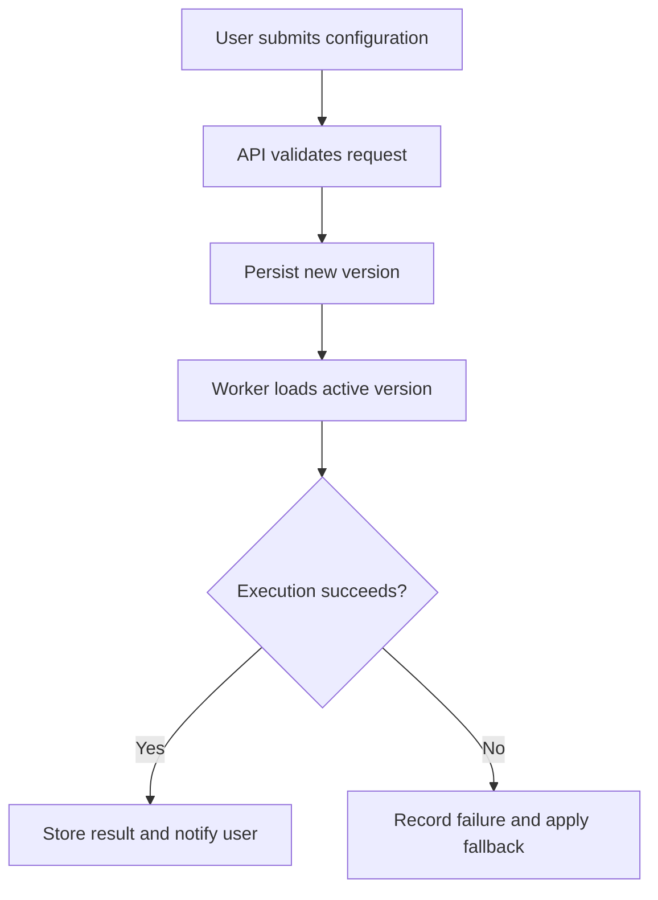
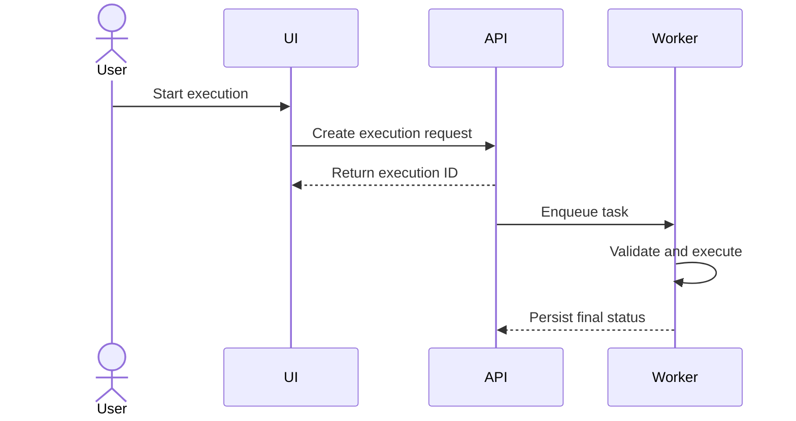

# Mermaid Diagrams for PR Review

Use Mermaid only when a diagram reduces reviewer effort. It is an optional PR-description module, not a required decoration and not part of a Git commit message.

## When to Include One

Add one concise diagram when the PR introduces or materially changes at least one of these:

- A feature flow spanning multiple components or services.
- An asynchronous trigger, scheduler, queue, retry, fallback, or notification chain.
- A workflow, agent handoff, data pipeline, or persistence lifecycle.
- A state machine with meaningful transitions or failure states.
- An abstraction whose caller, extension point, default behavior, and runtime implementation are otherwise hard to review together.

Usually omit diagrams for copy changes, dependency updates, one-file refactors, simple CRUD, isolated style fixes, or flows already obvious from a short bullet list.

## Choose the Smallest Useful Diagram

| Need | Mermaid type |
|---|---|
| End-to-end business or data flow | `flowchart TD` or `flowchart LR` |
| Time-ordered calls across actors | `sequenceDiagram` |
| Lifecycle and transitions | `stateDiagram-v2` |

Prefer one diagram with roughly 5-12 nodes. Split only when one diagram would mix unrelated review questions.

## Content Rules

- Derive every node and edge from the final diff, tests, or verified runtime behavior.
- Show the implemented path, important branch/fallback, and user-visible result.
- Do not present planned or unimplemented behavior as active. Label non-goals explicitly or omit them.
- Use business terms first; include internal class or function names only when they help locate review risk.
- Quote labels containing spaces, punctuation, parentheses, slashes, or non-ASCII text.
- Keep syntax compatible with the target GitHub/GitLab renderer. Avoid custom themes, external assets, and experimental diagram types.
- Do not include secrets, private URLs, customer identifiers, tokens, or sensitive payloads.
- Place the diagram after the completed-scope summary and before commit records or deep implementation detail.

## Flowchart Example

````markdown
## Overall Flow


````

## Sequence Example

````markdown

````

## Validation

Before delivery:

1. Compare the diagram against the final committed code and tests.
2. Confirm arrows, branches, fallbacks, and side effects are accurate.
3. Render or preview it when the available platform or tooling supports Mermaid.
4. If rendering cannot be checked, state that syntax was reviewed but visual rendering was not verified.
5. Remove the diagram if it merely repeats the bullet list without adding structure.
