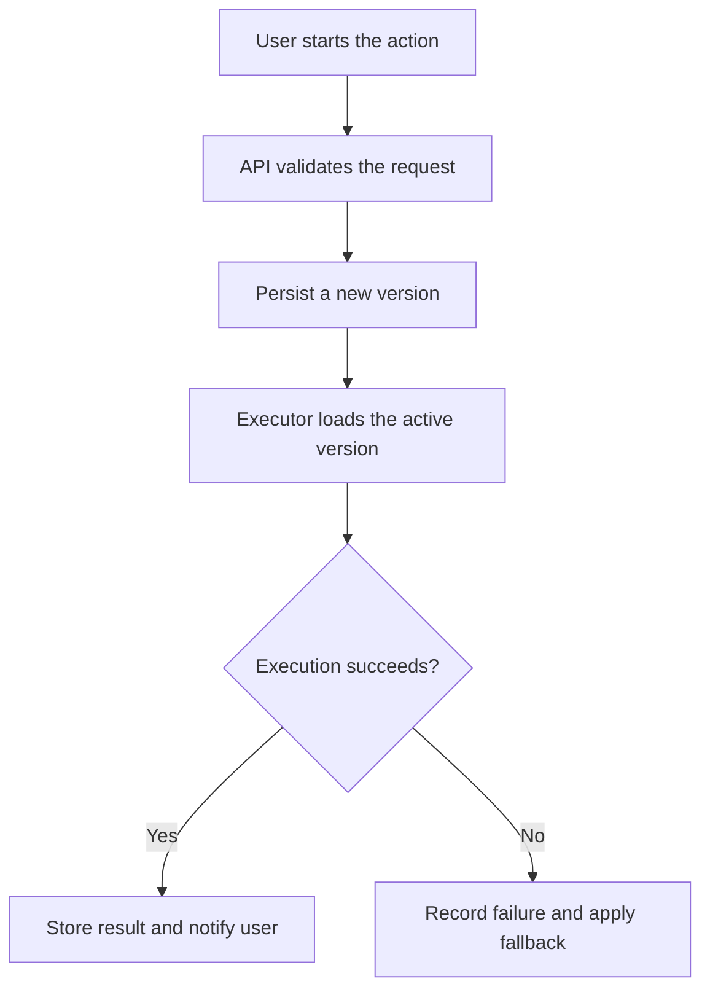

# English PR Templates

Load only the template sections relevant to the current PR. Do not concatenate every optional module.

## Pre-Commit Draft

````markdown
# PR Description Draft

## Background

The goal of this requirement is XXX.

Requirement doc: [include only when available]

## Planned Scope

- XXX
- XXX

## Commit Plan

| Planned Commit | Goal | Main Files | Review Focus |
|---|---|---|---|
| `feat(xxx): ...` | XXX | XXX | XXX |
| `test(xxx): ...` | XXX | XXX | XXX |

## Planned Verification

1. XXX
2. XXX

## Risks / To Confirm

- To confirm: XXX

## Not Included

- XXX
````

Do not invent commit hashes or present planned tests as passed.

## Final Post-Commit Description

````markdown
# PR Description

## Background

The goal of this requirement is XXX.

Requirement doc: [include only when available]

## What This PR Does

- XXX
- XXX

## Commit Records

| Commit | Goal | Main Files | Review Focus |
|---|---|---|---|
| `abc1234 feat(xxx): ...` | XXX | XXX | XXX |
| `def5678 test(xxx): ...` | XXX | XXX | XXX |

## Data / API / Entry Points

| Type | Change | Notes |
|---|---|---|
| Data | XXX | XXX |
| API | XXX | XXX |
| Page / usage entry | XXX | XXX |

## Verification Path

1. XXX
2. XXX

## Verified With

| Type | Command / Check | Result |
|---|---|---|
| Automated | `pytest ...` | Passed |
| Manual | XXX | Passed |

## Not Included

- XXX
````

Keep only relevant rows in the data/API/entry-point table. Remove the table for simple PRs.

## Mermaid Overall Flow Module (Optional)

Include this only when a cross-component, multi-stage, asynchronous, stateful, fallback, or agent-handoff flow is hard to explain with a short list. Place it after “What This PR Does” and before “Commit Records” in most descriptions.

````markdown
## Overall Flow


````

Every node and edge must be supported by the final diff or verification evidence. Omit the diagram for simple PRs.

## Bugfix / Data Investigation Module

````markdown
## Symptom

XXX.

## Investigation Conclusion

The issue is mainly caused by XXX, not XXX.

## Root Cause Breakdown

1. XXX
2. XXX

## Fixed in This PR

- XXX

## Not Fixed in This PR

- XXX, because XXX.

## Follow-up for Mentor / Upstream Team

- XXX

## Evidence

| Evidence | Conclusion |
|---|---|
| SQL / logs / screenshots / tests | XXX |
````

## Calculation Methodology Module

````markdown
## Calculation Methodology

Data source: XXX.

Formula:

```text
result = XXX
```

Selection rule: XXX.

Fallback: XXX.

Limitations: XXX.
````

## Scheduler Module

````markdown
## Trigger Chain

config -> worker scan -> due item -> execution -> business task -> notification

## Log Example

```text
[scheduler] due_item ...
[scheduler] execution_completed ...
```

## Failure Handling

- XXX
````

## AI / Prompt Module

````markdown
## AI Input

- XXX

## AI Output

- Human-readable report: XXX
- Structured output: XXX

## Human Confirmation Boundary

- AI only generates suggestions.
- XXX is not executed automatically.

## Evidence

- Prompt snapshot: XXX
- JSON / logs / run summary: XXX
````

## Example Module

````markdown
## Example: XXX

Use when: XXX.

Usage:

```http
POST /api/example
Content-Type: application/json

{"key":"value"}
```

Expected result: XXX.
````

## Screenshot Module

````markdown
## Screenshots

| Screenshot | Notes |
|---|---|
| Screenshot 1: User completes XXX | Shows XXX state |
| Screenshot 2: Execution result | Shows XXX succeeded |
````

## Short Mentor Update

````markdown
Hi [name], this is the latest PR:
[PR link]

Main change: XXX.

This completes XXX. Users can now do XXX from XXX, and XXX has been verified.

Not included in this round: XXX.
````

Keep it to 4-8 lines. Do not include the full commit table in a chat update.
